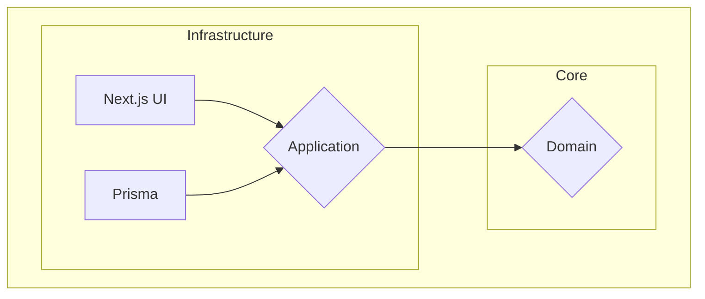

# Modular Hexagonal Architecture with Next.js

This project is a practical example of how to implement a **Modular Hexagonal Architecture** in a **Next.js** application, bootstrapped with [`create-next-app`](<https://www.google.com/search?q=%5Bhttps://nextjs.org/docs/app/api-reference/cli/create-next-app%5D(https://nextjs.org/docs/app/api-reference/cli/create-next-app)>). It demonstrates a clean separation of concerns, making the codebase more maintainable, scalable, and testable. It also showcases the use of **Server Actions** for handling form submissions and data mutations.

## Architecture

This project is built upon the principles of **Hexagonal Architecture** (also known as Ports and Adapters), which aims to isolate the application's core logic from external concerns. We've also incorporated the concept of **Modularity**, where the application is divided into independent and cohesive modules.

### Core Concepts

- **Domain:** This is the heart of the application. It contains the business logic, entities, and rules. It has no dependencies on any other layer.
- **Application:** This layer orchestrates the use cases of the application. It depends on the domain layer and defines the interfaces (ports) that the infrastructure layer must implement.
- **Infrastructure:** This layer contains the implementation details, such as databases, external services, and UI frameworks. It depends on the application layer and provides concrete implementations (adapters) for the defined ports.

## Integrations

This project integrates with several third-party services, which are treated as part of the infrastructure layer:

- **[Clerk](https://clerk.com/):** Used for user authentication and management, providing a complete solution for sign-up, sign-in, and user profile management.
- **[Stripe](https://stripe.com/):** A payment processing platform used to handle online payments securely.
- **[Mercado Pago](https://www.mercadopago.com/):** Another payment platform, particularly popular in Latin America, providing an alternative for payment processing.

### Diagram



## Where the Application Layer is Being Applied

In this project, the **application layer** is primarily applied within the **Next.js `page.tsx` files** located in the `src/app` directory. These pages act as the **primary adapters**, orchestrating the application's use cases by calling Server Actions, which in turn interact with the domain services.

For example, in `src/app/products/add/page.tsx`, the form submission is handled by a Server Action that utilizes the `ProductService` to create a new product. This demonstrates the separation of concerns, where the UI (the page) is decoupled from the business logic (the domain service).

## Directory Structure

The project is organized into the following main directories:

- **`src/app`**: This is the entry point of the Next.js application, which acts as the **primary adapter**. The `page.tsx` files within this directory are responsible for handling user interactions, presenting data, and orchestrating the application's use cases.
- **`src/common`**: This directory contains shared components, libraries, and utilities that are used across the application.
  - **`lib/actions`**: This is where the **Server Actions** are defined. They handle form submissions and data mutations on the server-side, ensuring a clean separation of concerns and a seamless user experience.
- **`src/modules`**: This is where the core logic of the application resides. Each sub-directory represents a **module** with its own domain, application, and infrastructure layers.
  - **`products/`**: An example module that manages products.
    - **`domain/`**: Contains the product entity, repository interface, and domain service.
    - **`infrastructure/`**: Provides concrete implementations for the repository interface, such as a Prisma-based repository and an in-memory repository for testing.

### Prerequisites

- Bun
- Docker

### Installation & Setup

1.  **Clone the repo**
    ```sh
    git clone https://github.com/roberthparreiras/knowledges.git
    ```
2.  **Navigate to the project directory**
    ```sh
    cd modular-hexagonal-architecture
    ```
3.  **Install dependencies**
    ```sh
    bun install
    ```
4.  **Set up environment variables**
    - Create a `.env.local` file by copying the example:
      ```sh
      cp .env.local.example .env.local
      ```
5.  **Run the development environment**
    ```sh
    docker compose -f docker-compose.dev.yml --env-file .env.local up -d --build
    ```
6.  **Apply database migrations**
    ```sh
    bunx prisma migrate dev
    ```
7.  **Seed the database**
    ```sh
    bun run seed
    ```

---

## Running Tests

To run the tests, use the following command:

```sh
bun run test
```
